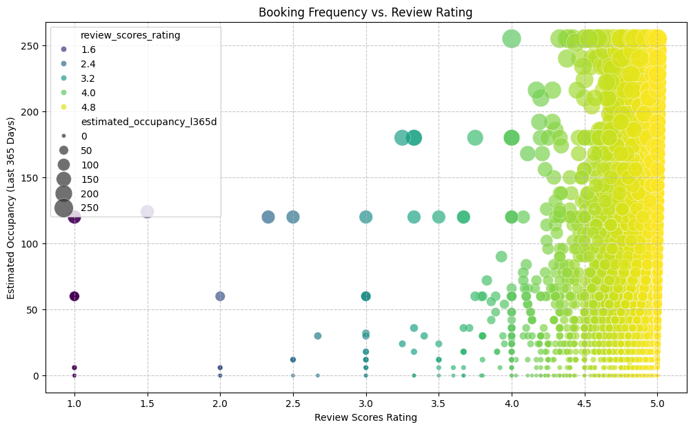
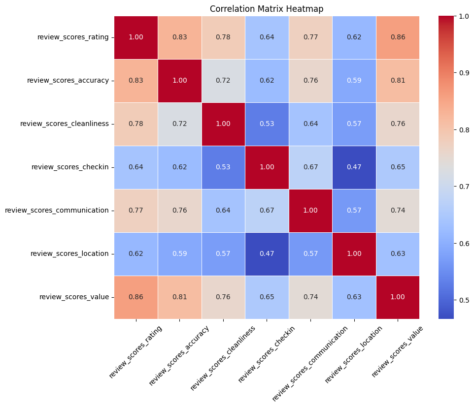
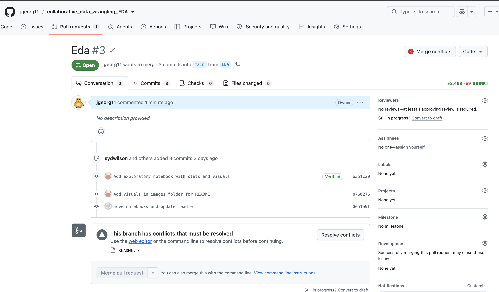

# Project Title: Inside Airbnb Nashville, Tennessee Data Analysis

## Dataset Information
Source: [Inside Airbnb](https://insideairbnb.com/get-the-data/).

Date accessed: 02SEP2026

Description:
The Inside Airbnb Nashville, Tennessee, dataset contains publicly collected information about short-term rental activity in Nashville, Tennessee.

---

File Name: listings.csv

File Shape: (10242 rows, 90 columns)

File Size: 32.3 MB

---

File Name: reviews.csv

File Shape: (838603 rows, 6 columns)

File Size: 233.4 MB

---

Cleaned and Combined Dataset Shape:

File Name: listings_with_review_summary.csv

File Shape: (10242 rows, 77 columns)

File Size: 32.7 MB

---

License: [Creative Commons Attribution 4.0 International License](http://creativecommons.org/licenses/by/4.0/)

## Methods
### Data Cleaning (John George)
steps taken to clean the data:
- enumerate the csv files and read them into pandas dataframes
- list unique IDs in the listings and reviews datasets
- identify and remove duplicate and missing values
- clean and standardize text, date, money, boolean, and percentage columns
- aggregate reviews by listing ID and merge with listings dataset

tools used:
- pandas
- numpy

### Exploratory Data Analysis (Sydney Wilson)
#### Made the insights given using the following summary statistics and visualizations: 

- Summary statistics used: mean, median, correlation, maximum, minimum, count/unique values
-   Found these using ```.describe()``` command
-   Also took advantage of correlation computation to view how different features affected each other

- Visualizations: histograms, heatmaps, tables/data frames, scatterplots
-   Tools: seaborn, pandas, matplotlib.pyplot, numpy, Counter from collections library

- Notes: ```price_quote_total_price``` uses ```price``` and ```minimum_nights``` to provide an estimate on what someone would pay to book a listing
- There is multiple "review scores" columns in the dataset. Most of our analysis focuses on the ```review_scores_rating```, which represents the overall 1-5 star rating you see attached to the listing.
- I used the ```listing_url``` column to manually explore outliers.  This led to finding some errors and unusual values on ```price``` and ```minimum nights```. We cannot pinpoint the causation of this, but Airbnb allows hosts to change these settings which means that scraped information may be out of date when data is collected.
-   I attempted to fix some errors on ```minimum_nights``` and ```price```. However, after doing some correlation calculations on "price", I decided to exclude it from further analysis to focus on reviews scores and how they interact with amenities and bookings. 

## Results
Overall, price has a strong, positive correlation with number of bedrooms and bathrooms. We also found that the review score rating was the most correlated with the value and accuracy review scores, suggesting that customers may value these characteristics more when rating a listing. Listings with more than 10 reviews were generally likely to have ratings above 4 stars, while listings with fewer reviews showed much more variation in their ratings. ***John insert sentence about low rating = less bookings = less reviews*** We also examined the relationship between review ratings and the number of days a listing was occupied over the previous 365 days. Higher-rated listings tended to have more occupied days than listings with ratings of 1–2 stars. Finally, the amenities listed for a property appeared to have a negligible relationship with its overall review rating. 

### Visualizations
- Scatterplot of review score rating vs. number of reviews



- Heatmap of correlation between review score rating and other review scores



## Collaboration Notes
### Partner A contributions:
- data cleaning
- repo setup
- merge conflict resolution

### Partner B contributions:
- EDA
- visualizations
- statistics

### Both:
- documentation

## Reproducibility Instructions
Run commands from the repository root so the notebook paths resolve consistently after the notebooks moved into `notebooks/`.

```bash
python -m pip install pandas numpy matplotlib seaborn jupyter
jupyter notebook notebooks/data_cleaning.ipynb
jupyter notebook notebooks/DataWranglingEDA.ipynb
```

Run the notebooks in this order:
1. `notebooks/data_cleaning.ipynb` reads `data/listings.csv` and `data/reviews.csv`, cleans and merges them, and writes `data/listings_with_review_summary.csv`.
2. `notebooks/DataWranglingEDA.ipynb` reads `data/listings_with_review_summary.csv` and produces the exploratory statistics and plots.

Required input files:
- `data/listings.csv`
- `data/reviews.csv`

Python dependencies:
- pandas
- numpy
- matplotlib
- seaborn
- jupyter

## Merge Conflict Reflection (Required)
I created conflicted commits to this README using a second, patching branch. To resolve the conflict, I used GitHub.com's built-in merge deconfliction tool and chose to accept the current change instead of the incoming change.


